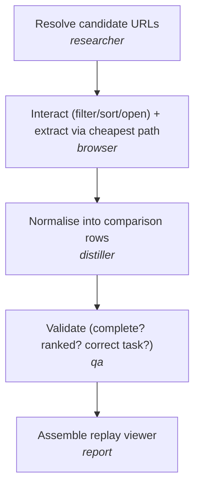
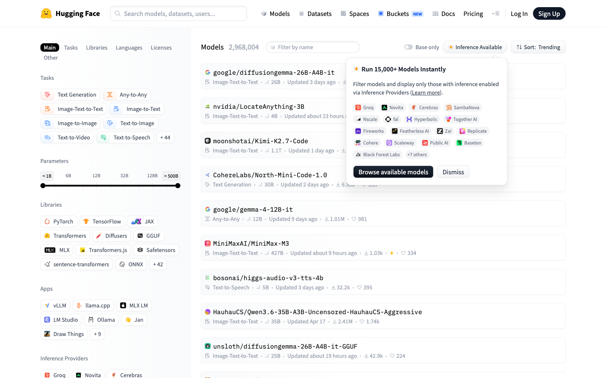
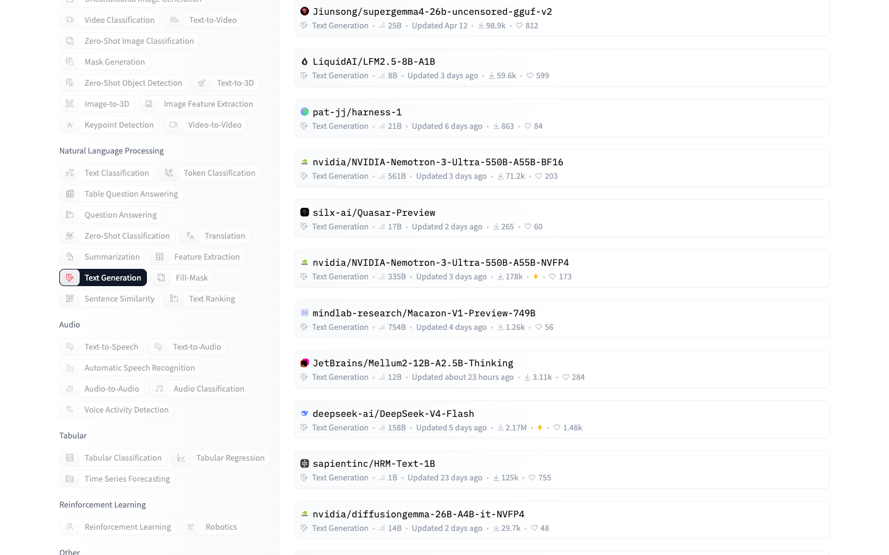
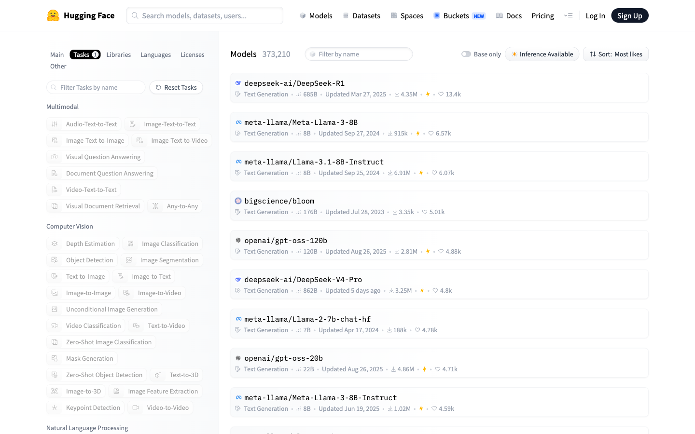
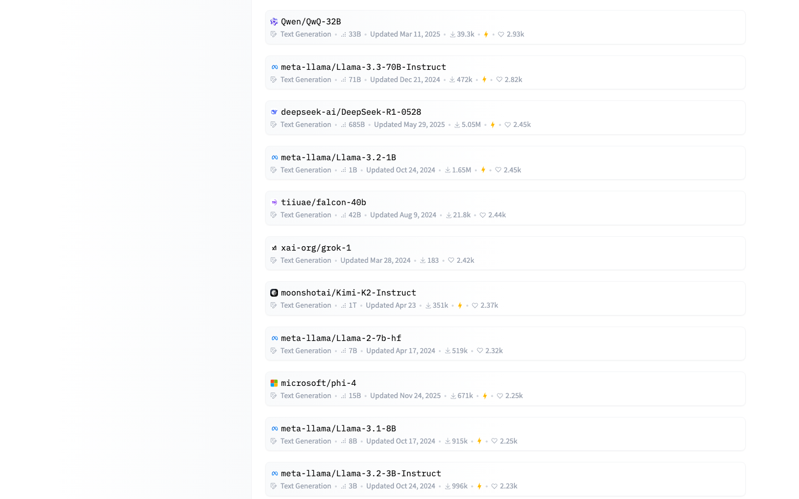
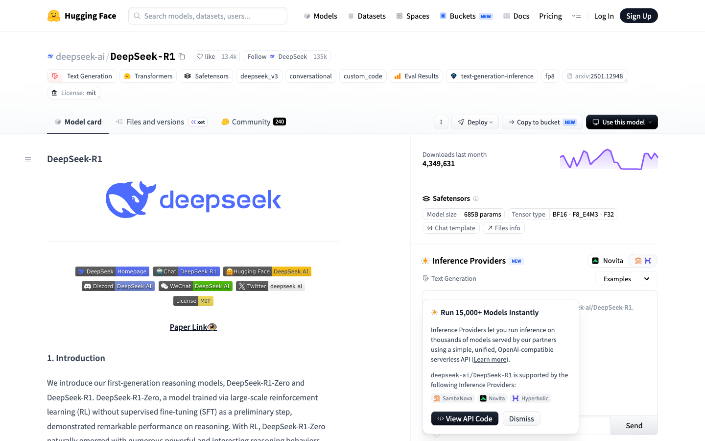
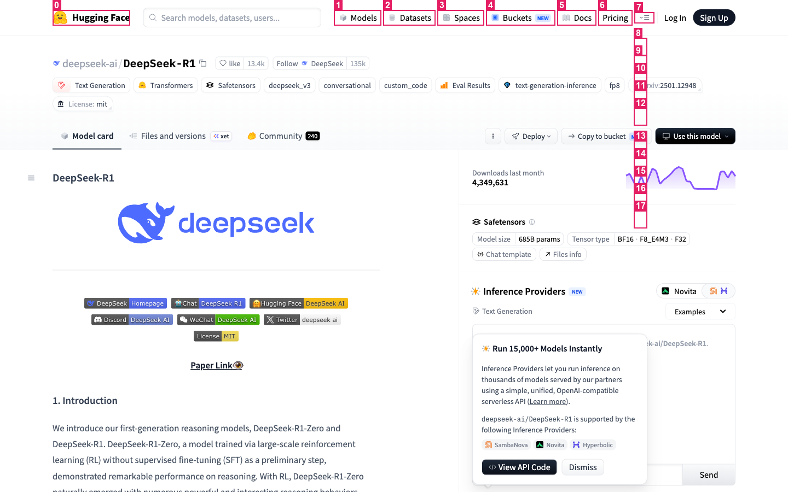
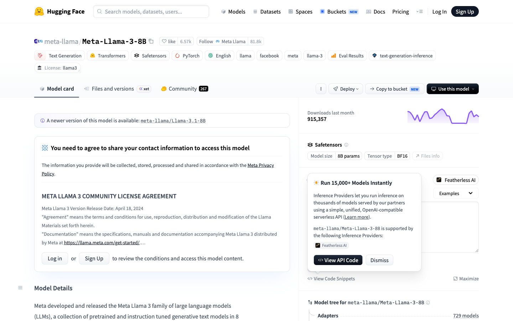
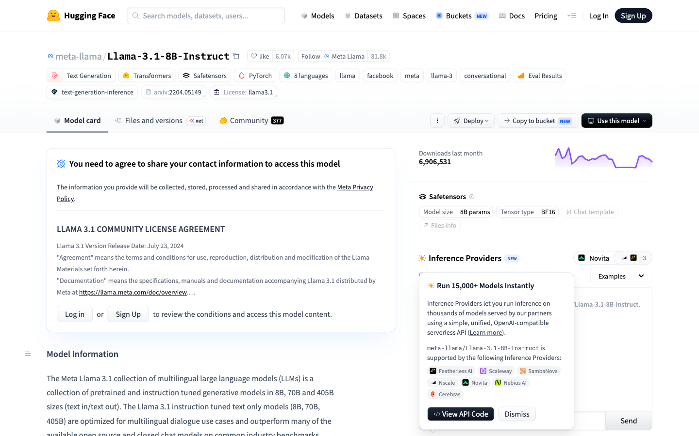

# Browser-Agent — Session 9 (llm_gatewayV9)

A **browser-capable agent** that completes a real comparison task on a dynamic,
JavaScript-rendered website and produces a full **replay view** of the run.

It demonstrates what Session 8's `web_search` + `fetch_url` **cannot** do:
it opens a real Chromium browser and performs visible, multi-step interactions
(filter → sort → scroll → open detail pages) before extracting data via the
**cheapest correct path** (`extract → deterministic → a11y → vision → blocked`).

> **Demo task:** _Compare the top 3 Hugging Face text-generation models, ranked by likes_
> **Primary browser path chosen:** `extract` · **Turns:** 6 ·
> **Browser actions:** 9 · **Est. cost:** $0.0109

---

## 🖥️ Companion: Computer-Use skill (five-layer cascade)

The same catalogue and **frozen orchestrator** now also drive **real desktop apps**.
`run_cu.py` registers three new skills (`planner`, `computer_use`, `report_cu`) and
solves three macOS tasks through a **five-layer control cascade** —
`L1 deterministic → page (Electron CDP) → L2a hotkeys → L2b a11y/text-LLM → L3 vision → L4 blocked` —
recording each run with `start_recording` into a **trajectory directory** (the evidence).

| Task | Headline layer | Vision calls | Constraint |
|---|---|---|---|
| Calculator (`123+654=`) | **L2a** hotkeys | 0 | zero-vision ✅ _(runs live once macOS Accessibility is granted)_ |
| Cursor (Electron) | **page** — CDP over `electron_debugging_port` | 0 | Electron page path ✅ |
| Canvas game (no ARIA) | **L3** vision (set-of-marks) | 1 | uses vision ✅ |

```bash
python run_cu.py          # or: ./demo_cu.sh   (visible run, auto-opens the replay)
```

Per-run evidence lands in `artifacts/cu-latest/` — `replay.html`, `report.md`, `trace.json`,
and `trajectory/<task>/` (ordered `frames/` + `trajectory.jsonl` + `meta.json`).
Full write-up: [`COMPUTER_USE.md`](COMPUTER_USE.md).

---

## What makes this not "passive scraping"

`fetch_url("https://huggingface.co/models")` returns the **default Trending**
listing as static HTML. The data this task needs — *Text-Generation models
ranked by likes, with per-model detail* — only exists **after** you:

1. **filter** the catalogue to the Text-Generation task (click),
2. **sort** it by *Most likes* (open dropdown → click), and
3. **open each top model's detail page** (multi-page navigation).

Those are exactly the ≥3 visible browser actions the rubric requires, and they
change the result set. See the [replay](#sample-run--all-8-required-elements) below.

## Architecture (orchestrator is frozen)

```
User goal
  └─▶ Planner ───────── emits a DAG of skill calls (LLM, with deterministic fallback)
        └─▶ Researcher ── resolves candidate URLs
              └─▶ Browser skill ── interact + "cheapest correct path?"
                     ├ extract        (static / embedded JSON)
                     ├ deterministic  (CSS selectors)
                     ├ a11y           (accessibility tree / ARIA roles)
                     ├ vision         (set-of-marks screenshot)
                     └ blocked        (recover or report)
                    └─▶ Distiller ── normalise into comparison rows
                          └─▶ QA / Critic ── validate (sorted? complete?)
                                └─▶ Replay Viewer ── this report
```

The **orchestrator (`orchestrator/`) is generic and never edited** for a new
task: it only knows how to ask the planner for a DAG and run skills from the
**catalogue**. All task/site behaviour is added as skills — the Browser skill
and its `recipe_hf.py` extension. See [`ARCHITECTURE.md`](ARCHITECTURE.md).

## Repository layout

| Path | Role |
|---|---|
| `orchestrator/` | **Frozen** engine: DAG executor, catalogue, trace, cost meter |
| `gateway/llm_gateway.py` | Single metered choke-point for all Anthropic calls (graceful no-key fallback) |
| `skills/planner_skill.py` | Emits the plan DAG from the catalogue |
| `skills/researcher_skill.py` | Resolves candidate URLs |
| `skills/browser_skill.py` + `skills/browser/` | **The extension point**: session, path cascade, HF recipe, set-of-marks |
| `skills/distiller_skill.py` / `qa_skill.py` / `report_skill.py` | Normalise → validate → assemble the replay payload |
| `skills/report/render.py` | Renders `replay.html`, `report.md`, this README |
| `run.py` | Composition root: builds the catalogue + runs the orchestrator |
| `skills/computer_skill.py` + `skills/computer/` | **Computer-Use extension**: five-layer cascade, recorder, macOS/Electron/canvas backends, task recipes |
| `run_cu.py` · `demo_cu.sh` · `COMPUTER_USE.md` | Computer-Use composition root, one-command demo, write-up |
| `artifacts/latest/` | Newest run: `replay.html`, `trace.json`, `trace.zip`, `report.md`, `screenshots/` |
| `artifacts/cu-latest/` | Newest **computer-use** run: `replay.html`, `report.md`, `trace.json`, `trajectory/` |

## Quickstart

```bash
python3 -m venv .venv && source .venv/bin/activate
pip install -r requirements.txt
python -m playwright install chromium
```

**One command for a recordable demo:**

```bash
./demo.sh
```

Opens a **visible** Chromium window, drives the full flow live, and opens the
Replay Viewer with all 8 elements. It uses your `ANTHROPIC_API_KEY` if set
(fully live); otherwise an offline **demo gateway** populates the LLM plan,
vision read, and cost summary so nothing is blank for the recording.

Or run it explicitly:

```bash
export ANTHROPIC_API_KEY=sk-ant-...      # optional; LLM-free / demo-gateway without it
HEADLESS=0 SLOW_MO=400 python run.py "Compare the top 3 Hugging Face text-generation models by likes"
```

Outputs land in `artifacts/run-<timestamp>/` and are mirrored to
`artifacts/latest/`. Open `artifacts/latest/replay.html` for the interactive
viewer, or `playwright show-trace artifacts/latest/trace.zip` for Playwright's
own time-travel replay.

---

## Sample run — all 8 required elements

_Auto-generated from the latest run's `trace.json`._

## 1. Original user goal

> Compare the top 3 Hugging Face text-generation models, ranked by likes

## 2. Planner DAG

_Plan produced by: **llm** planner._



## 3. Browser path chosen

**Primary data path: `extract`**  ·  all paths exercised this run: `deterministic`, `extract`, `a11y`, `vision`

| Intent | Chosen | Cascade ladder (cheapest → costliest) |
|---|---|---|
| filter: Text Generation task | `deterministic` | ✅ deterministic _(css a[href*='pipeline_tag=text-generation'])_ |
| open sort menu | `deterministic` | ✅ deterministic _(css button:has-text('Trending'))_ |
| sort: Most likes | `deterministic` | ✅ deterministic _(css text=Most likes)_ |
| listing: top-3 model ids (sorted by Most likes) ⭐ | `extract` | ✅ extract _(list[3])_ |
| model detail fields: deepseek-ai/DeepSeek-R1 ⭐ | `extract` | ✅ extract _(dict{id,likes,downloads_last_month,downloads_all_time,pipeline_tag,library})_ |
| a11y capability check: likes for deepseek-ai/DeepSeek-R1 | `a11y` | ✅ a11y _(read 13.4k via role=button[3])_ |
| vision capability check: likes for deepseek-ai/DeepSeek-R1 | `vision` | ✅ vision _(set-of-marks LLM read likes=13387)_ |
| model detail fields: meta-llama/Meta-Llama-3-8B ⭐ | `extract` | ✅ extract _(dict{id,likes,downloads_last_month,downloads_all_time,pipeline_tag,library})_ |
| model detail fields: meta-llama/Llama-3.1-8B-Instruct ⭐ | `extract` | ✅ extract _(dict{id,likes,downloads_last_month,downloads_all_time,pipeline_tag,library})_ |

## 4. Browser actions taken

| # | Action | Path | Target | Detail | URL |
|---|---|---|---|---|---|
| 1 | navigate |  | https://huggingface.co/models | open models listing | huggingface.co/models |
| 2 | click | deterministic | expand Tasks facet | reveal hidden filter list | huggingface.co/models |
| 3 | click | deterministic | filter: Text Generation task | a[href*='pipeline_tag=text-generation'] | huggingface.co/models?pipeline_tag=text-generation&sort=trending |
| 4 | click | deterministic | open sort menu | button:has-text('Trending') | huggingface.co/models?pipeline_tag=text-generation&sort=trending |
| 5 | click | deterministic | sort: Most likes | text=Most likes | huggingface.co/models?pipeline_tag=text-generation&sort=likes |
| 6 | scroll |  |  | 1600 | huggingface.co/models?pipeline_tag=text-generation&sort=likes |
| 7 | navigate |  | https://huggingface.co/deepseek-ai/DeepSeek-R1 | open model detail #1 | huggingface.co/deepseek-ai/DeepSeek-R1 |
| 8 | navigate |  | https://huggingface.co/meta-llama/Meta-Llama-3-8B | open model detail #2 | huggingface.co/meta-llama/Meta-Llama-3-8B |
| 9 | navigate |  | https://huggingface.co/meta-llama/Llama-3.1-8B-Instruct | open model detail #3 | huggingface.co/meta-llama/Llama-3.1-8B-Instruct |

## 5. Screenshots & page-state logs

**models landing (default trending sort)** — `huggingface.co/models`



**after filter -> Text Generation** — `huggingface.co/models?pipeline_tag=text-generation&sort=trending`



**listing: Text Generation sorted by Most likes** — `huggingface.co/models?pipeline_tag=text-generation&sort=likes`



**after scroll** — `huggingface.co/models?pipeline_tag=text-generation&sort=likes`



**model 1: deepseek-ai/DeepSeek-R1** — `huggingface.co/deepseek-ai/DeepSeek-R1`



**set-of-marks vision overlay — 18 candidate marks** — `huggingface.co/deepseek-ai/DeepSeek-R1`



**model 2: meta-llama/Meta-Llama-3-8B** — `huggingface.co/meta-llama/Meta-Llama-3-8B`



**model 3: meta-llama/Llama-3.1-8B-Instruct** — `huggingface.co/meta-llama/Llama-3.1-8B-Instruct`



_Page-state log:_

| t (s) | URL | Title | Note |
|---|---|---|---|
| 13.782 | huggingface.co/models | Models – Hugging Face | landing (default sort) |
| 24.392 | huggingface.co/models?pipeline_tag=text-generation&sort=likes | Text Generation Models – Hugging Face | filtered + sorted listing |
| 29.654 | huggingface.co/deepseek-ai/DeepSeek-R1 | deepseek-ai/DeepSeek-R1 · Hugging Face | model page: deepseek-ai/DeepSeek-R1 |
| 34.029 | huggingface.co/meta-llama/Meta-Llama-3-8B | meta-llama/Meta-Llama-3-8B · Hugging Face | model page: meta-llama/Meta-Llama-3-8B |
| 37.219 | huggingface.co/meta-llama/Llama-3.1-8B-Instruct | meta-llama/Llama-3.1-8B-Instruct · Hugging Face | model page: meta-llama/Llama-3.1-8B-Instruct |

## 6. Extracted data (raw, per model)

```json
[
  {
    "rank": 1,
    "id": "deepseek-ai/DeepSeek-R1",
    "url": "https://huggingface.co/deepseek-ai/DeepSeek-R1",
    "source_path": "extract",
    "card_text": "deepseek-ai/DeepSeek-R1 Text Generation \u2022 685B \u2022 Updated Mar 27, 2025 \u2022 4.35M \u2022 \u2022 13.4k",
    "likes": 13387,
    "downloads_last_month": 4349631,
    "downloads_all_time": 27738105,
    "pipeline_tag": "text-generation",
    "library": "transformers",
    "license": "mit",
    "params": "685B",
    "last_modified": "2025-03-27",
    "created_at": "2025-01-20",
    "tags": [
      "transformers",
      "safetensors",
      "deepseek_v3",
      "text-generation",
      "conversational",
      "custom_code",
      "arxiv:2501.12948",
      "license:mit",
      "eval-results",
      "text-generation-inference"
    ],
    "likes_a11y": 13400,
    "likes_vision": "13387"
  },
  {
    "rank": 2,
    "id": "meta-llama/Meta-Llama-3-8B",
    "url": "https://huggingface.co/meta-llama/Meta-Llama-3-8B",
    "source_path": "extract",
    "card_text": "meta-llama/Meta-Llama-3-8B Text Generation \u2022 8B \u2022 Updated Sep 27, 2024 \u2022 915k \u2022 \u2022 6.57k",
    "likes": 6572,
    "downloads_last_month": 915357,
    "downloads_all_time": 42926383,
    "pipeline_tag": "text-generation",
    "library": "transformers",
    "license": "llama3",
    "params": "8.0B",
    "last_modified": "2024-09-27",
    "created_at": "2024-04-17",
    "tags": [
      "transformers",
      "safetensors",
      "llama",
      "text-generation",
      "facebook",
      "meta",
      "pytorch",
      "llama-3",
      "en",
      "license:llama3"
    ]
  },
  {
    "rank": 3,
    "id": "meta-llama/Llama-3.1-8B-Instruct",
    "url": "https://huggingface.co/meta-llama/Llama-3.1-8B-Instruct",
    "source_path": "extract",
    "card_text": "meta-llama/Llama-3.1-8B-Instruct Text Generation \u2022 8B \u2022 Updated Sep 25, 2024 \u2022 6.91M \u2022 \u2022 6.07k",
    "likes": 6066,
    "downloads_last_month": 6906531,
    "downloads_all_time": 155915803,
    "pipeline_tag": "text-generation",
    "library": "transformers",
    "license": "llama3.1",
    "params": "8.0B",
    "last_modified": "2024-09-25",
    "created_at": "2024-07-18",
    "tags": [
      "transformers",
      "safetensors",
      "llama",
      "text-generation",
      "facebook",
      "meta",
      "pytorch",
      "llama-3",
      "conversational",
      "en"
    ]
  }
]
```

## 7. Final comparison table

| # | Model | Likes | Downloads/mo | Params | License | Task | Updated |
|---|---|---|---|---|---|---|---|
| 1 | [deepseek-ai/DeepSeek-R1](https://huggingface.co/deepseek-ai/DeepSeek-R1) | 13,387 | 4.3M | 685B | mit | text-generation | 2025-03-27 |
| 2 | [meta-llama/Meta-Llama-3-8B](https://huggingface.co/meta-llama/Meta-Llama-3-8B) | 6,572 | 915K | 8.0B | llama3 | text-generation | 2024-09-27 |
| 3 | [meta-llama/Llama-3.1-8B-Instruct](https://huggingface.co/meta-llama/Llama-3.1-8B-Instruct) | 6,066 | 6.9M | 8.0B | llama3.1 | text-generation | 2024-09-25 |

**🏆 Most-liked:** deepseek-ai/DeepSeek-R1 (13,387 likes)


> deepseek-ai/DeepSeek-R1 is the clear community favourite with 13,387 likes, ahead of meta-llama/Meta-Llama-3-8B, meta-llama/Llama-3.1-8B-Instruct. The shortlist spans 8.0B–685B parameters across llama3, llama3.1, mit licenses, so the most-liked model is not necessarily the smallest or most-downloaded.

## 8. Turn count & cost summary

| Metric | Value |
|---|---|
| Turns (executed DAG steps) | **6** |
| Browser actions | 9 |
| Screenshots captured | 8 |
| LLM calls | 5 |
| Input tokens | 1,852 |
| Output tokens | 353 |
| **Estimated cost (USD)** | **$0.0109** |
| Wall-clock duration | 38.69 s |

> ℹ️ _LLM calls in this run used the offline **demo gateway** (mocked responses); token counts & cost are estimated from listed model prices. Export `ANTHROPIC_API_KEY` to make every call fully live._

## QA / Critic

**Verdict: ✅ PASS**

| Check | Result | Detail |
|---|---|---|
| collected models (target 3) | ✅ | 3 model(s) collected |
| every model has a likes value | ✅ | all present |
| correctly ranked by likes (descending) | ✅ | 13,387 ≥ 6,572 ≥ 6,066 |
| all models are 'text-generation' | ✅ | text-generation |
| cross-path likes agree (extract vs a11y/vision) | ✅ | extract=13,387 · a11y=13400 · vision=13387 |

> All structural checks pass: the requested number of text-generation models were collected, correctly ranked by descending likes, with cross-path agreement between the static-extract and accessibility readings. The comparison is trustworthy for ranking by popularity.
