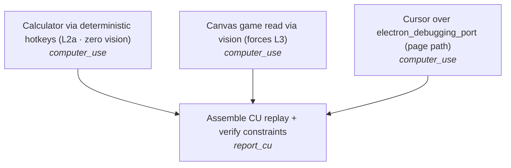
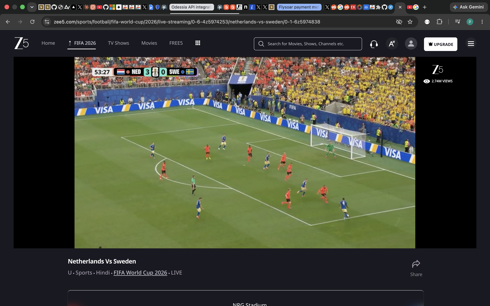
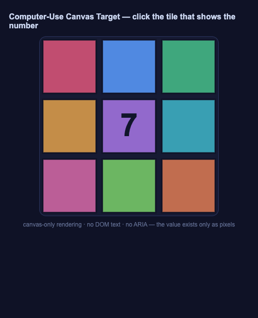
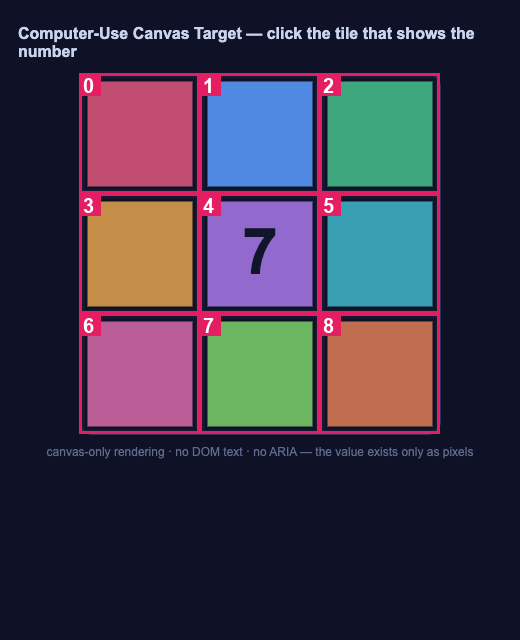
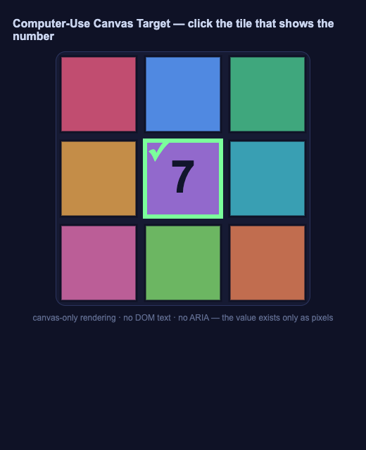
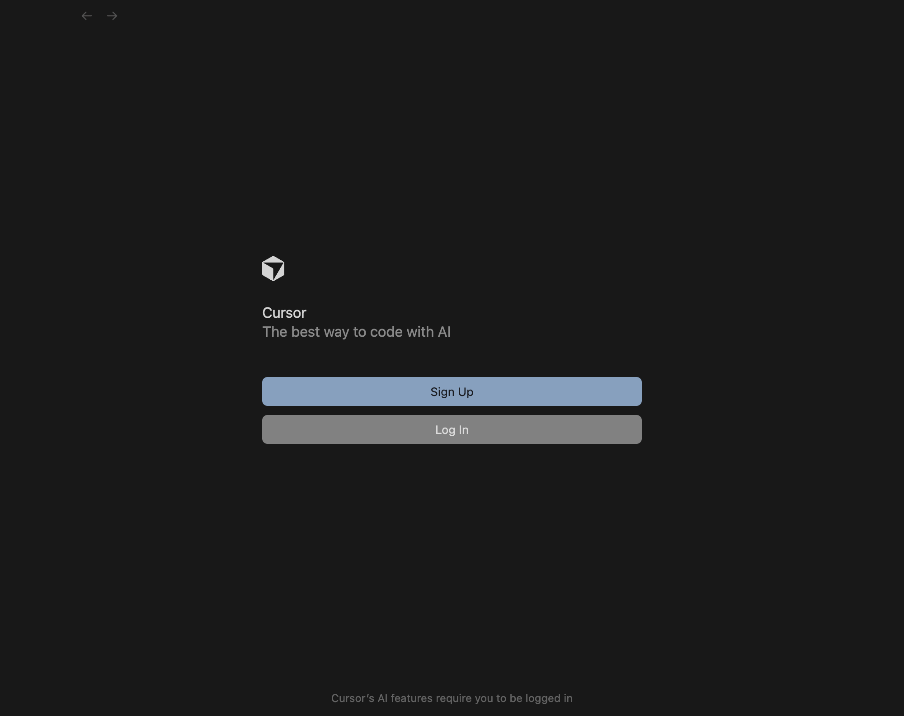

## 1. Goal

> Solve three real desktop tasks through the five-layer control cascade: Calculator via hotkeys (zero vision), a canvas game via vision, and a draft in Cursor over the Electron debug port.

## 2. Plan (DAG of catalogue skills)

_Plan source: **fallback**._

## 3. Constraint satisfaction

| Constraint | Status | Evidence |
|---|---|---|
| ≥1 task uses vision (L3) | ✅ | canvas_vision: 1 vision call(s) |
| ≥1 task uses the Electron page path | ✅ | electron_cursor: headline layer = page (CDP via debug port) |
| ≥1 task completes with ZERO vision calls | ✅ | electron_cursor: status=ok, vision_calls=0 |

## 4. Five-layer cascade — per-intent ladder

Legend (cheapest → costliest): `L1`=1 · `page`=1 · `L2a`=2 · `L2b-ax`=3 · `L3`=4 · `L4`=5

| Task-intent | Chosen | Ladder tried (✅ ok · ❌ failed · ⏭️ not reached) |
|---|---|---|
| preflight: Accessibility permission for synthetic input ⭐ | `failed` | ❌ L4 _(System Events refused assistive access (error -1719). Grant Terminal/host app Accessibility in System Settings → Privacy & Security → Accessibility.)_ |
| read the number rendered on the canvas ⭐ | `L3` | ❌ L2b-ax _(empty / invalid)_ · ✅ L3 _(dict{mark,value})_ |
| click the vision-identified tile #4 ⭐ | `L1` | ✅ L1 _(ok)_ |
| launch Cursor --remote-debugging-port (isolated profile) ⭐ | `L1` | ✅ L1 _(ok)_ |
| attach Playwright over CDP (the page tool) ⭐ | `page` | ✅ page _(ok)_ |
| open an untitled editor (page channel) ⭐ | `page` | ✅ page _(ok)_ |
| type the draft into the editor ⭐ | `page` | ✅ page _(ok)_ · ⏭️ L2a _(not reached (cheaper layer sufficed))_ |
| read the composed draft back from the editor DOM ⭐ | `L2b-ax` | ✅ L2b-ax _(list[4])_ · ⏭️ L3 _(not reached (cheaper layer sufficed))_ |
| L2b cheap text-LLM judge: is the composed draft well-formed? | `L2b-llm` | ✅ L2b-llm _(4/4 expected lines present (offline: deterministic check))_ |

## 5. Actions taken

| # | Action | Layer | Target/Intent | Detail |
|---|---|---|---|---|
| 1 | read | L3 | read the number rendered on the canvas | dict{mark,value} |
| 2 | click | L1 | click the vision-identified tile #4 | tile 4 |
| 3 | do | L1 | launch Cursor --remote-debugging-port (isolated profile) | port 9223 |
| 4 | do | page | attach Playwright over CDP (the page tool) | 127.0.0.1:9223 |
| 5 | do | page | open an untitled editor (page channel) | ok |
| 6 | do | page | type the draft into the editor | 5 lines |
| 7 | read | L2b-ax | read the composed draft back from the editor DOM | list[4] |

## 6. Per-task verification

### calculator — 🚧 BLOCKED
_Compute 123+654 = 777 in Calculator via hotkeys; verify without vision_

- headline layer: `None` · vision calls: **0** · trajectory: `trajectory/calculator/`

| Check | Result | Detail |
|---|---|---|
| Accessibility permission | ❌ | not granted — task cannot send keystrokes |

### canvas_vision — ✅ PASS
_Read the number on a canvas (no ARIA) via vision, then click its tile_

- headline layer: `L3` · vision calls: **1** · trajectory: `trajectory/canvas_vision/`

| Check | Result | Detail |
|---|---|---|
| L2b DOM/AX read found no number (vision required) | ✅ | dom_number_probe()='' → escalate to L3 |
| vision returned a reading | ✅ | tile=4 value='7' |
| vision value == rendered number | ✅ | read='7' expected='7' |
| vision tile == target tile | ✅ | read tile=4 expected=4 |
| clicking the vision tile solved the puzzle | ✅ | window.__cu_game.solved=True |
| vision layer exercised (>=1 call) | ✅ | vision_calls=1 |

### electron_cursor — ✅ PASS
_Compose a draft in Cursor (Electron) over electron_debugging_port; verify via DOM_

- headline layer: `page` · vision calls: **0** · trajectory: `trajectory/electron_cursor/`

| Check | Result | Detail |
|---|---|---|
| attached to Electron via debug port | ✅ | vscode-file://vscode-app/Applications/Cursor.app/Contents/Resources/app/out/vs/code/electron-sandbox/workbench/workbench |
| draft composed in untitled buffer (no file saved) | ✅ | 5 lines typed via CDP keyboard |
| DOM read-back: all lines present | ✅ | 4/4 lines matched |
| contains the five-layer cascade line | ✅ | found 'L1 -> page -> L2a -> L2b -> L3' |
| ZERO vision calls | ✅ | vision_calls=0 |

## 7. Trajectory frames

**blocked: no accessibility permission**

**canvas target opened**

**L3 set-of-marks vision overlay**

**vision read complete**

**clicked tile 4**

**puzzle solved**

**Cursor workbench attached**

**untitled editor open**

**after typing the draft**

**draft verified via DOM read-back**

## 8. Turns & cost

| Metric | Value |
|---|---|
| Turns (DAG steps) | **5** |
| Actions | 7 |
| Trajectory frames | 10 |
| LLM / vision calls | 3 |
| Est. cost (USD) | $0.0073 |
| Wall-clock | 64.2 s |

> ℹ️ Vision / text-judge calls used the offline **demo gateway** (mocked). Set `ANTHROPIC_API_KEY` to make every call live with zero code changes.